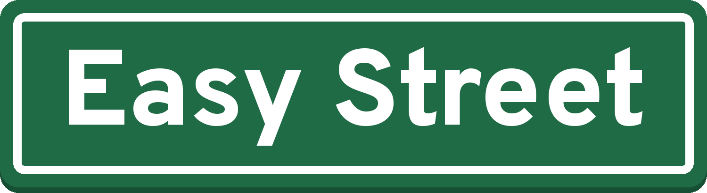

# Easy Street

**Demystify the market. Get the information. Live on Easy Street.**

Easy Street is an educational app that breaks the stock market down into plain English. It explains the events that move the market, like Fed decisions, jobs reports, and inflation numbers, and then lets you make your own call using points, not money.

No jargon. No real money. No pressure. Just the information you need, broken down so anyone can follow it.

---

## Why Easy Street?

A lot of people stay away from the stock market because it feels like a locked door. The words are confusing, the numbers move fast, and nobody stops to explain what any of it means.

Easy Street is built for beginners. If you've ever heard "the Dow was down today" and wondered what that actually means, this app is for you.

## How it works

1. **Read the explainer.** Every market event gets a simple card: *What is it? Why it matters. What to watch.*
2. **Make your call.** Answer one question, like "Will the S&P 500 finish the week higher?"
3. **Put in points.** Choose 50, 100, or 200 points. Everyone starts with 1,000.
4. **See what happened and why.** Every result comes with a short lesson, so win or lose, you learn something.

## What's inside

- **This week:** Market events explained, each with a prediction question.
- **Learn:** A glossary of market words in plain English (S&P 500, Dow Jones, Nasdaq, NYSE, the Fed, inflation, index funds, and more).
- **Moving Day (Plus preview):** A sneak peek at the daily movers feed, with sample data.
- **My picks:** Your record and point balance.

## Design

Easy Street is simple on purpose. The layout is clean, the type is large and easy to read, and every screen does one job. The look is inspired by a green street sign, a friendly signpost pointing the way.

## Not financial advice

Easy Street is for learning only. Points have no cash value, and nothing in the app is financial advice. There are no real-money trades or prediction contracts.

## Status

**Prototype.** The app runs in any browser and installs on your phone like a regular app. Practice rounds use simulated outcomes.

### Roadmap

- Resolve predictions using real market data
- New explainer cards each week
- Streaks and badges for learning milestones

### Coming soon: Easy Street Plus

More ways to learn, including **Moving Day**: a daily look at what's moving in the market, and why, in plain English. You can peek at it now in the app's Moving Day tab. Stay tuned.

## Run it

Open `index.html` in any web browser. No setup required.

## Family of apps

Easy Street is a sister app to **PolyPulse**, which demystifies prediction markets. Both are built on the same idea: explain it simply, then let people try it with no risk.

---

## Rights

Easy Street, Moving Day, the Easy Street street-sign logo, and all code, text, and artwork in this repository are © 2026 Galsinger Media LLC. All rights reserved. No license is granted to copy, modify, or distribute any part of this project.

© 2026 Galsinger Media LLC. All rights reserved.
Created by Aisha Hosley Abiola.
